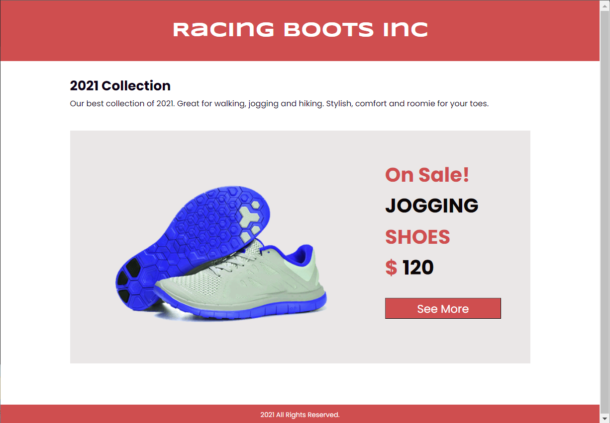

# web602-hw-w4d1

## Description
The goal of this HW is to refactor a `.css` stylesheet into a `.less` stylesheet.

The `stylecss.png` file displays the stylesheet that can produce the expected display, but you are not allowed to re-create a `style.css` file by typing each line. It has to be generated by compiling a `.less` file, which is the work to be done.

You will be practicing the nested rules, as well as import, in LESS.

## Steps
1. Based on the content in `stylecss.png`, create `racing.less`.
2. Create `colors.less` and `fonts.less` to declare variables for colors and fonts to be used.
3. Replace explicit color names and font names with those variables.
4. Run `lessc less/racing.less css/style.css` to get the stylesheet `css/style.css` linked in `index.html`.

## Test
### Expected

### Actual

